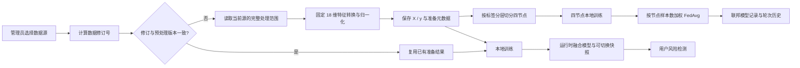

# 项目逻辑审查与验证报告

审查日期：2026-08-09

## 结论

本轮已把“数据源发现 → 数据准备 → 四节点切分 → 本地训练 / 联邦训练 → 模型版本 → 用户检测”的主链路统一起来。当前未发现阻断启动、数据处理、训练、模型加载或主要页面使用的已知缺陷。

系统不再把“文件存在”误报成“数据可用”，也不会在处理数据时隐式训练模型。数据、节点和训练任务均通过数据源 ID、数据修订号、准备版本和预处理版本建立明确关联。

## 主链路

## 系统本身是否有模型

有，但需要区分三类边界：

| 模型域 | 实际内容 | 用途 | 是否直接用于用户检测 |
| --- | --- | --- | --- |
| 运行时融合模型 | Isolation Forest、监督分类器（有 XGBoost 时使用 XGBoost，否则 Logistic Regression）、NumPy LSTM | 用户端风险分数、攻击类型和模型版本 | 是 |
| 平台基准模型 | 兼容旧接口的 IF / Logistic / Q-learning 管理器 | 基准与旧功能兼容 | 否 |
| 联邦训练模型 | 四节点本地线性模型与 FedAvg 全局权重 | 展示并验证四节点联邦训练链路 | 否，当前不会自动替换运行时融合模型 |

启动时只加载已有模型；仅在运行时模型不存在或预处理版本不兼容时进行一次 bootstrap。导入 `src.*` 子模块不会再初始化 PrimiHub 客户端、尝试网络连接或加载无关训练依赖。

## 每次训练与各节点的关系

| 操作 | 使用的数据 | 与四节点关系 | 产生的结果 |
| --- | --- | --- | --- |
| 数据处理 | 当前选中的一个数据源 | 生成或复用四个按标签分层的节点分片 | 准备元数据、X / y、四节点文件；不训练模型 |
| 本地训练 | 当前数据源在请求上限内的样本 | 不经过节点 | 直接更新运行时融合模型并创建完整版本快照 |
| 联邦训练 | 当前准备版本的全部四节点数据 | 四节点分别本地训练，再按各节点样本数加权聚合 | 联邦版本记录、全局权重、节点验证指标和轮次历史 |

联邦训练接口现在强制检查：数据源 ID、数据修订号、准备版本、预处理版本、节点数量和节点样本总数必须一致。未准备的数据源会返回冲突状态，不再临时覆盖其他数据源的节点文件。

## 当前数据源处理的是全部还是新增

当前策略是“变化后全量重建，未变化直接复用”，不是增量追加：

- 数据修订未变化：直接复用现有 X / y 和四节点文件，不重复读 CSV、不重复归一化、不重复切分。
- 数据修订发生变化：对当前数据源在处理上限内的数据全量重建。
- 单次最多处理 50,000 条；源数据超过上限时处理前 50,000 条，并在元数据中记录处理范围。
- 用户提交池发生新增、审核状态变化或源文件大小 / 修改时间变化时，会形成新修订并触发重建。
- 数据处理本身不会触发本地训练或联邦训练；训练必须由独立接口显式启动。

采用这一策略是因为四节点分层切分、固定特征转换和准备版本必须保持整体一致。若以后改为真正增量处理，需要额外设计去重键、增量归一化、节点再平衡和可回滚事务，不能简单把新行追加到现有 `.npy` 文件。

## 性能实测

本机使用 `data/generated/train.csv` 的 7,996 条、18 维数据进行实测：

| 场景 | 结果 |
| --- | --- |
| 首次完整准备 | 176.317 ms，约 45,350 行 / 秒 |
| 四节点样本数 | 2,000 / 2,000 / 1,998 / 1,998 |
| 相同修订再次处理 | 服务端约 0.97–1.38 ms |
| 复用请求端到端中位数 | 约 4.48 ms |
| 本地融合模型训练 | 7,996 条，约 1.09 秒 |
| 四节点联邦训练一轮 | 7,996 条，约 0.09 秒 |

性能慢的主要根因是包级 `__init__.py` 的急切导入。过去导入任意 `src.*` 子模块时会连带初始化两套 PrimiHub 客户端并加载检测 / 优化依赖；现在改为兼容旧接口的惰性导入。隔离进程导入 `src.preprocess.feature_engineering` 约 163 ms，未加载 PrimiHub、检测器或优化器模块。

## 关键一致性与安全修正

- 使用固定范围的 18 维归一化，单条样本结果不再依赖同批次其他样本。
- `response_time_ms` 明确转换为秒，消除训练和检测单位不一致。
- 只有预处理版本兼容且节点完整时才显示“联邦已就绪”。
- 显式指定的数据源不存在或样本不足时直接报错，不再静默切换到另一个数据源。
- 本地训练的请求上限是唯一训练范围，不再叠加隐藏的 5,000 条截断。
- 联邦聚合指标按节点样本数加权；数据准备版本变化时重置联邦上下文。
- Isolation Forest 风险分数使用训练期校准，不再受当前请求批次极值影响。
- 用户上传原文仅作为临时文件使用，持久归档为 AES 加密副本。
- 运行时模型、平台基准模型和联邦模型记录使用不同目录 / 边界，避免相互冒充。
- Flask 不再把项目根目录作为静态目录，源码、数据库和环境配置路径返回 404。
- 管理接口需要会话；默认管理密码仅允许本机调试，公网部署必须配置独立密码。
- 启动、重启和部署脚本不再按端口或 Python 进程名进行宽泛清理。

## 当前能力边界

- 四节点是同一数据源的逻辑分片，用于验证联邦流程，不等同于四家真实机构的跨网络部署。
- Paillier 当前用于展示参数量化、加密、密态聚合和解密开销；实际模型权重仍由 FedAvg 聚合，不应描述为完整密文训练。
- 本地训练指标在训练样本上计算；联邦指标来自节点内留出数据并按样本数加权。两者都不等同于独立外部测试集评估。
- 内置 Flask / Werkzeug 服务适合课程项目和验收环境；若长期公网运行，应放在反向代理和生产 WSGI 服务之后。

## 验证范围

- 项目结构和 64 个 Python 文件语法检查。
- 启用 Flask 集成测试的完整回归：143 项全部通过，无跳过、无失败。
- 本地双端口启动、首页、管理端、健康接口、数据源接口和模型状态检查。
- 受保护路径检查：`.env.example`、`app.py`、`data/system.db`、`src/main.py` 均返回 404。
- 数据首次准备、重复复用、本地模型训练、四节点联邦训练和 Paillier 指标链路实测。
- 独立进程惰性导入检查，确认没有意外加载 PrimiHub / 检测 / 优化模块。

测试通过代表上述范围内未发现已知缺陷，不等同于对所有未来输入、第三方依赖和真实跨机构网络环境作绝对无缺陷保证。
