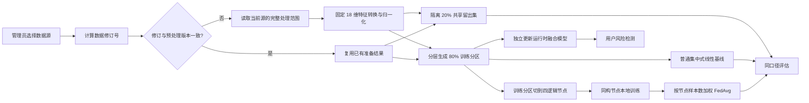

# 项目逻辑审查与验证报告

审查日期：2026-08-09

## 结论

本轮已把“数据源发现 → 数据准备 → 共享留出 → 普通集中式/FedAvg 同构对比 → 独立运行时模型 → 用户检测”的主链路统一起来。当前未发现阻断启动、数据处理、训练、模型加载或主要页面使用的已知缺陷。

系统不再把“文件存在”误报成“数据可用”，也不会在处理数据时隐式训练模型。数据、节点和训练任务均通过数据源 ID、数据修订号、准备版本和预处理版本建立明确关联。

## 主链路

## 系统本身是否有模型

有，但需要区分四类边界：

| 模型域 | 实际内容 | 用途 | 是否直接用于用户检测 |
| --- | --- | --- | --- |
| 运行时融合模型 | Isolation Forest、监督分类器（有 XGBoost 时使用 XGBoost，否则 Logistic Regression）、NumPy LSTM | 用户端风险分数、攻击类型和模型版本 | 是 |
| 普通集中式线性基线 | 完整训练分区上的线性二分类器 | 与四节点 FedAvg 作同模型、同数据、同轮数对比 | 否 |
| 联邦训练模型 | 四节点同构线性模型与 FedAvg 全局权重 | 分区训练、聚合并与普通基线同口径评估 | 否，当前不会自动替换运行时融合模型 |
| 平台基准模型 | 兼容旧接口的 IF / Logistic / Q-learning 管理器 | 旧功能兼容 | 否 |

启动时只加载已有模型；仅在运行时模型不存在或预处理版本不兼容时进行一次 bootstrap。导入 `src.*` 子模块不会再初始化 PrimiHub 客户端、尝试网络连接或加载无关训练依赖。

## 每次训练与各节点的关系

| 操作 | 使用的数据 | 与四节点关系 | 产生的结果 |
| --- | --- | --- | --- |
| 数据处理 | 当前选中的一个数据源 | 先隔离共享留出集，再把训练分区写入四节点 | 完整、训练、验证数组及准备元数据；不训练模型 |
| 普通集中式基线 | 当前准备版本的完整训练分区 | 不经过节点 | 线性基线记录、共享留出集指标；不更新运行时模型 |
| 联邦训练 | 与普通基线相同的训练分区 | 四节点各使用完整分片训练，再按样本数聚合 | FedAvg 权重、共享留出集指标、节点训练诊断和轮次历史 |
| 运行时模型更新 | 当前数据源的训练分区 | 不经过节点 | 直接更新 IF + 分类器 + NumPy LSTM 并创建完整快照 |

普通集中式与联邦接口现在强制检查：数据源 ID、数据修订号、准备版本、预处理版本、共享留出版本、节点数量和节点样本总数必须一致。未准备或旧结构的数据源会返回冲突状态，不再临时覆盖其他数据源的节点文件。

## 当前数据源处理的是全部还是新增

当前策略是“变化后全量重建，未变化直接复用”，不是增量追加：

- 数据修订未变化：直接复用现有 X / y 和四节点文件，不重复读 CSV、不重复归一化、不重复切分。
- 数据修订发生变化：对当前数据源在处理上限内的数据全量重建。
- 单次最多处理 50,000 条；源数据超过上限时处理前 50,000 条，并在元数据中记录处理范围。
- 用户提交池发生新增、审核状态变化或源文件大小 / 修改时间变化时，会形成新修订并触发重建。
- 重建时默认按标签分层保留 20% 共享留出集，其余 80% 才进入普通集中式和四节点训练。
- 数据处理本身不会触发运行时模型更新、普通集中式训练或联邦训练；训练必须由独立接口显式启动。

采用这一策略是因为四节点分层切分、固定特征转换和准备版本必须保持整体一致。若以后改为真正增量处理，需要额外设计去重键、增量归一化、节点再平衡和可回滚事务，不能简单把新行追加到现有 `.npy` 文件。

## 性能实测

在隔离临时目录中使用 2,000 条、18 维数据完整运行当前新链路：1,600 条进入训练分区，400 条进入共享留出集，普通集中式和四节点 FedAvg 均使用默认 20 轮。

| 场景 | 结果 |
| --- | --- |
| 普通集中式线性基线 | Accuracy 90.25%，Precision 100%，Recall 71.11%，F1 83.12%，Log Loss 0.3537 |
| 四节点 FedAvg | Accuracy 90.25%，Precision 100%，Recall 71.11%，F1 83.12%，Log Loss 0.3537 |
| 当前同分布逻辑节点差值 | Accuracy 0.00 个百分点 |
| 数据准备 + 两条训练链路 | 约 0.411 秒 |
| 4 节点 × 19 参数 Paillier 安全聚合（2048 位） | 首次密钥生成约 0.83 秒；加密约 14.70 秒，密态聚合约 0.05 秒，解密约 3.06 秒；最大权重误差约 4.44e-7 |

本次同分布分层节点得出相同结果是合理现象，只说明当前逻辑分片下两条实现口径一致，不代表所有非独立同分布数据都会相同。包级急切导入已改为惰性导入；数据源列表改为分块统计、按文件修订缓存、最多 5,000 行分布抽样和并发单飞。2GB 内存服务器继续使用单数值线程，50,000 行上限下不会把整个磁盘数据集同时装入内存。普通 FedAvg 保持默认，只有管理员主动选择时才承担 Paillier 成本。

## 关键一致性与安全修正

- 使用固定范围的 18 维归一化，单条样本结果不再依赖同批次其他样本。
- `response_time_ms` 明确转换为秒，消除训练和检测单位不一致。
- 只有预处理版本兼容且节点完整时才显示“联邦已就绪”。
- 显式指定的数据源不存在或样本不足时直接报错，不再静默切换到另一个数据源。
- 共享留出集不会写入四节点，普通集中式与联邦路径均不能用它拟合权重。
- 普通集中式和节点训练使用相同线性模型、批量梯度下降、L2 参数与默认 20 轮预算。
- FedAvg 最终指标来自与普通基线完全相同的共享留出集；节点自身指标只用于训练诊断。
- 可选 Paillier 路径对每个节点的模型参数执行定点量化、逐项加密、密态样本量加权与最终聚合权重解密；普通 FedAvg 路径保持不变。
- 每次新对比默认重置 FedAvg 权重和轮次；只有显式继续训练时才复用上下文，并按有效总轮数重新判断可比性。
- Isolation Forest 风险分数使用训练期校准，不再受当前请求批次极值影响。
- 用户上传原文仅作为临时文件使用，持久归档为 AES 加密副本。
- 运行时模型、普通集中式基线、平台兼容模型和联邦模型记录使用不同目录 / 边界，避免相互冒充。
- Flask 不再把项目根目录作为静态目录，源码、数据库和环境配置路径返回 404。
- 管理接口需要会话；默认管理密码仅允许本机调试，公网部署必须配置独立密码。
- 启动、重启和部署脚本不再按端口或 Python 进程名进行宽泛清理。

## 当前能力边界

- 四节点是同一数据源训练分区的逻辑节点，不等同于四家真实机构的跨网络部署；平台已保留将节点替换为独立服务的边界。
- Paillier 模式已经替换该轮实际权重聚合路径，但节点本地训练仍是明文计算，且当前平台进程在加密前可接触节点更新；因此应描述为“模型权重安全聚合”，而不是完整密文训练或跨机构端到端安全部署。
- 普通集中式与联邦指标来自同一内部共享留出集，可以比较当前两条实现，但仍不等同于独立外部测试集或跨机构真实流量评估。
- 内置 Flask / Werkzeug 服务适合本机开发；长期公网运行应放在反向代理和生产 WSGI 服务之后。

## 验证范围

- 项目结构和 69 个 Python 文件语法检查。
- 当前完整回归：176 项通过，21 项因可选环境条件跳过，无失败。
- 面向服务器 Python 3.6 的生产代码语法兼容检查；缺少 Gym / Gymnasium 时验证内置最小兼容层可正常运行。
- 本地双端口启动、首页、管理端、健康接口、数据源接口和模型状态检查。
- 受保护路径检查：`.env.example`、`app.py`、`data/system.db`、`src/main.py` 均返回 404。
- 数据首次准备、共享留出隔离、普通集中式基线、运行时模型更新、四节点联邦训练、Paillier 密态权重聚合及其 API 选择分支均有自动化覆盖。
- 2,000 条数据的隔离端到端链路实测，确认普通集中式与 FedAvg 使用同一训练/验证口径。
- 独立进程惰性导入检查，确认没有意外加载 PrimiHub / 检测 / 优化模块。

测试通过代表上述范围内未发现已知缺陷，不等同于对所有未来输入、第三方依赖和真实跨机构网络环境作绝对无缺陷保证。
